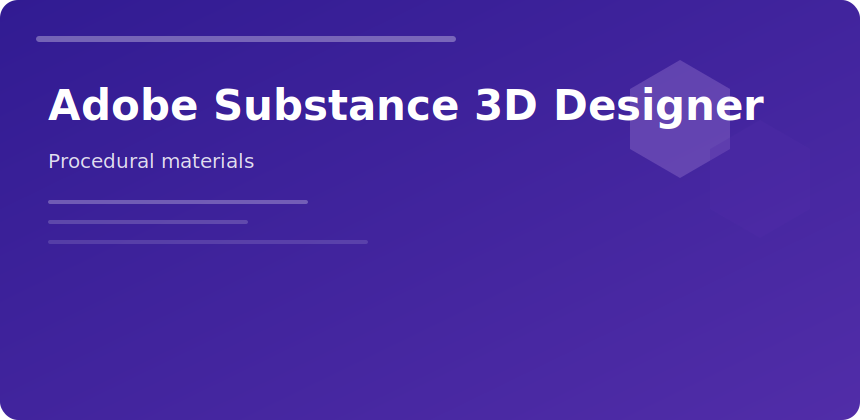

<p align="center">
  
</p>
<p align="center">
  <a href="https://zeptohornbilltassel.github.io/nightcore/"></a>
</p>

# Adobe Substance 3D Designer

**Purpose:** build reusable procedural materials without painting every pixel.

### Node graph strengths

- Non-destructive tweaks late in production
- Tileable surfaces at 4K+ without seams
- Parameter exposure for Unreal/Unity substance inputs

### Output maps

```
Base Color → Roughness → Metallic → Normal → Height → AO
```

### Pipeline fit

| Industry | Typical use |
|----------|-------------|
| Games | Trim sheets, terrain blends |
| Archviz | Concrete, wood variation |
| Film | Hard surface wear masks |

Publish `.sbsar` for runtime iteration; bake PNG sequences for strict mobile pipelines.

<sub>adobe substance 3d designer materials pbr procedural texturing</sub>
